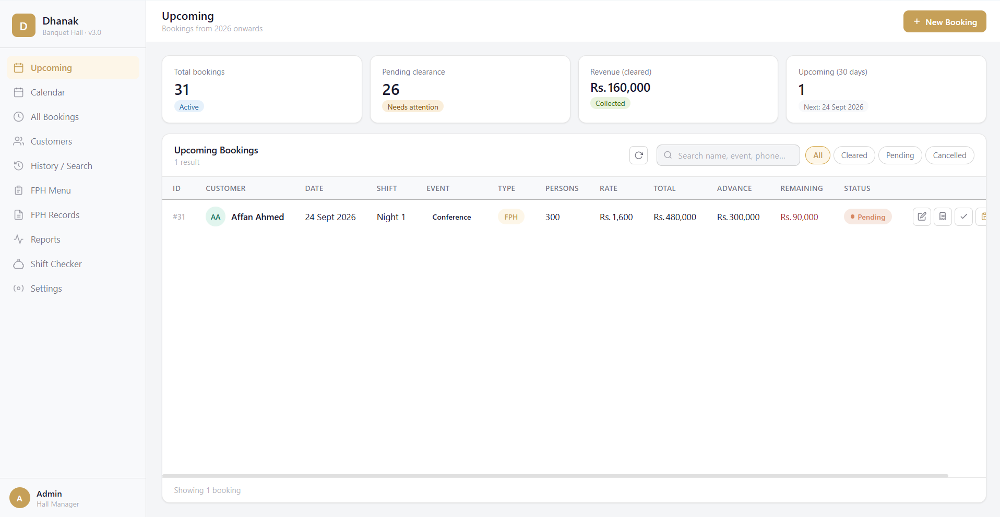
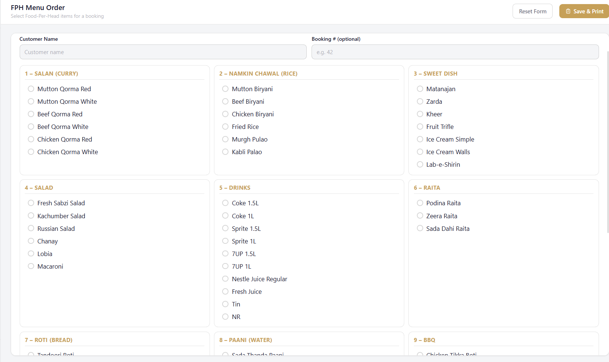
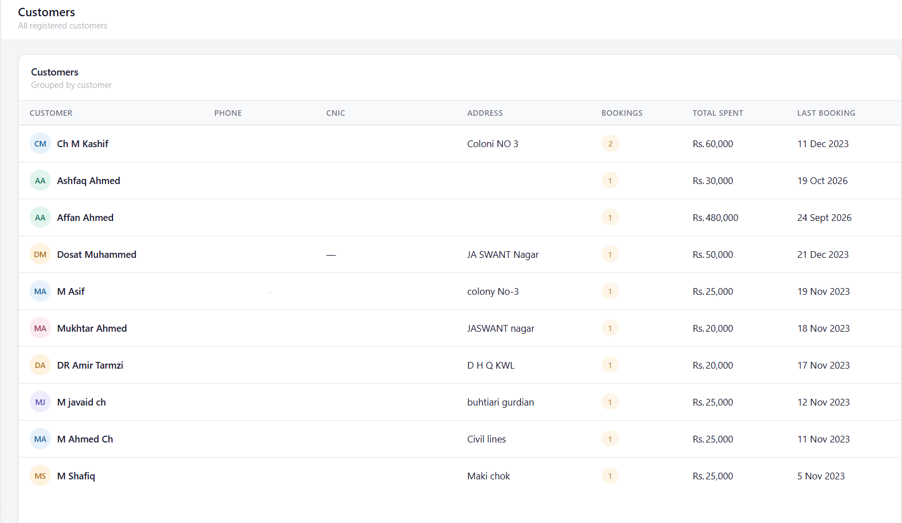
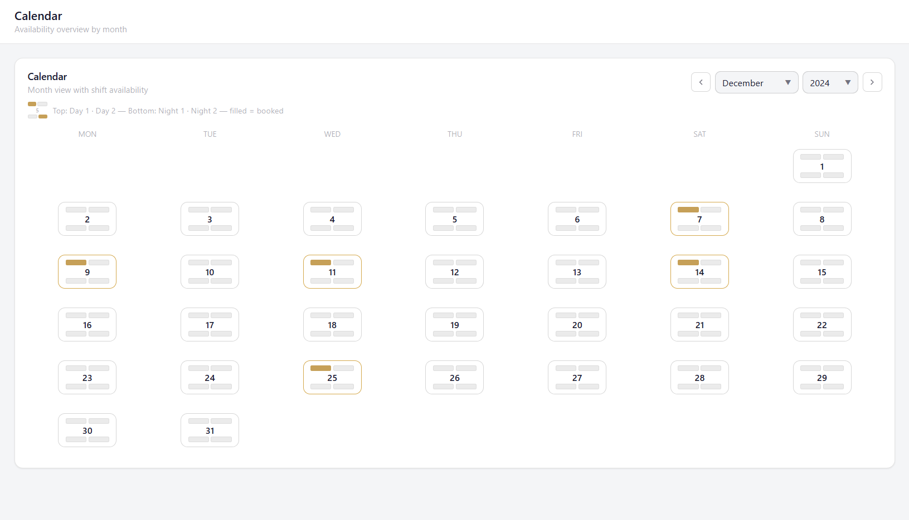
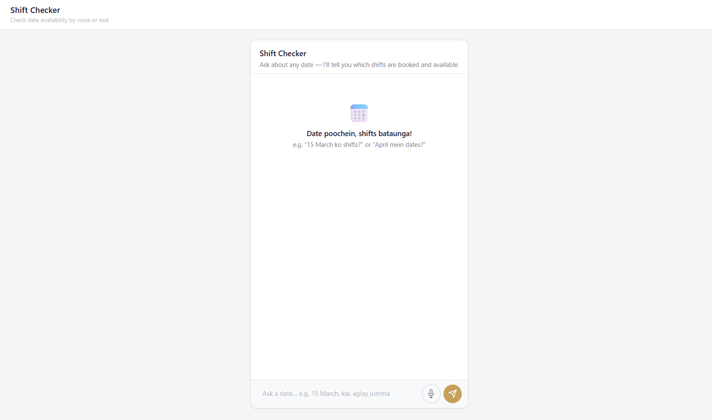

# Dhanak Banquet Hall — Booking Management System

A desktop booking management application built for a real banquet hall, written entirely in Python. It handles everything from taking bookings to printing receipts, tracking customers, and answering queries through an AI assistant — all running locally without any internet dependency for core operations.



---

## Screenshots

| | |
|---|---|
|  |  |
| *Main Dashboard* | *Custom FPH Menu Builder* |
|  |  |
| *Customer History* | *Booking Calendar* |


*AI Assistant*

---

## What It Does

Built for my father's banquet hall, this app replaced a manual register-based system. The whole thing stores data locally in SQLite and runs as a standalone `.exe` — no server, no cloud dependency, nothing to install on the hall's PC.

**Booking management** — create, edit, and cancel bookings with full customer details, event type, shift, guest count, and per-head rate. The app checks slot availability before confirming so double-bookings can't happen.

**Receipt generation** — two receipt types: a thermal-style booking receipt for the customer at the time of booking, and a full A4 clearance receipt generated at event clearance with final payment, discounts, tax breakdown, and extra seating charges.

**Tax handling** — FBR and PRA tax calculated automatically based on filer/non-filer status. Stored per booking and printed on the clearance receipt.

**FPH (Food Per Head) custom menu** — a visual menu builder where staff pick items per category (starters, main course, extras) and save the selection against a booking. Printable as a kitchen sheet.

**Customer history** — search by phone number and pull up every booking a customer has ever made, total spent, and first/last event date.

**Booking calendar** — a month view showing which dates and shifts are occupied, available, or fully booked. Click any day to see what's booked.

**Reports tab** — monthly and yearly summaries with revenue figures, booking counts, and a breakdown by event type.

**Upcoming events** — a quick view of the next 30 days of bookings so staff don't have to search.

**AI assistant** — text and voice queries against the booking database, powered by the Anthropic Claude API. Ask things like "how many weddings in March" or "show me bookings for next weekend" and get a natural language answer.

**Google Sheets sync** — optional one-click export to a Google Sheet using a service account, if the owner wants a cloud backup or shareable view.

**Auto backup** — SQLite backups saved to a local `backups/` folder on every run.

---

## Tech Stack

| Layer | What's used |
|---|---|
| UI framework | Python + CustomTkinter |
| Database | SQLite 3 via Python's `sqlite3` module |
| PDF generation | ReportLab |
| AI assistant | Anthropic Claude API (`anthropic` SDK) |
| Voice input | `speech_recognition` (Google STT) |
| Text-to-speech | `edge_tts` / `pyttsx3` |
| Google Sheets | `gspread` + `google-oauth2` |
| Packaging | PyInstaller (ships as a standalone `.exe`) |

The app has a second architecture layer (`bridge.py`, `database.py`, `app.js`) that wraps the backend for a Qt WebChannel-based HTML frontend — both interfaces share the same SQLite backend and business logic.

---

## Project Structure

```
Dhanak Banquet Hall/
├── dhanak.py          # Main application — all UI screens, DB class, receipt gen, AI/Voice
├── database.py        # High-level DB facade used by the HTML frontend
├── bridge.py          # Qt WebChannel bridge exposing Python methods to JS
├── app.js             # JS frontend logic (calendar, bookings table, AI chat UI)
├── dhanak_config.json # Hall configuration (name, address, printer names — see setup)
├── dhanak.spec        # PyInstaller build spec
├── build.bat          # Windows build script
└── dist/Dhanak/       # Compiled .exe and runtime files
```
## About

Built as a personal project for my father's banquet hall. First real-world application I shipped — everything in it comes from watching actual staff workflows and figuring out what the system needed to handle.
